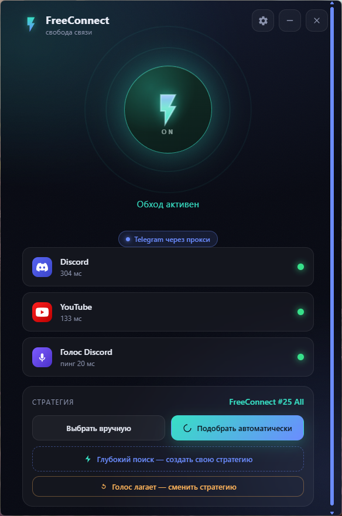
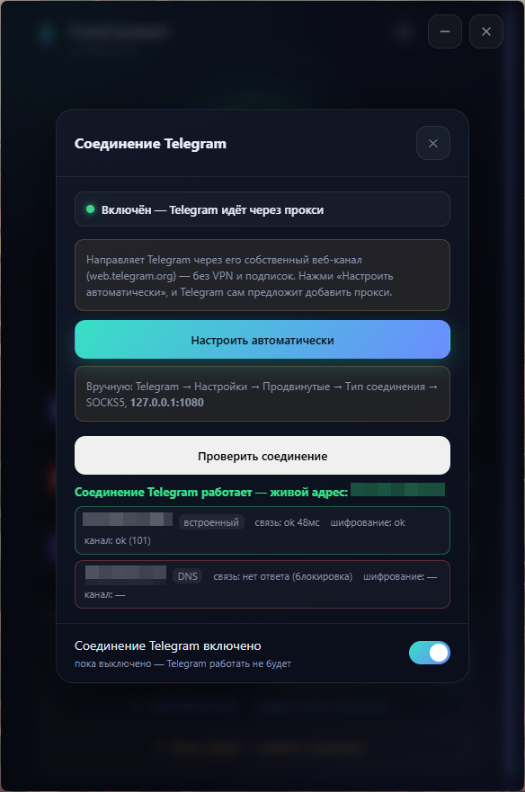

# ⚡ FreeConnect

**Стабильная связь в один клик.**
Discord, YouTube и Telegram работают ровно — без настроек, батников и танцев с бубном.

> ### ⚠️ Официальный источник — только этот репозиторий
> `github.com/cold-hell/FreeConnect`
>
> Любые другие сборки, «зеркала», сайты и «установщики» из других мест **могут быть заражены** —
> в этой нише вредоносные копии распространяют под чужими именами. Скачивай только из
> [релизов](https://github.com/cold-hell/FreeConnect/releases/latest) и сверяй контрольную сумму
> (SHA-256 указан в описании каждого релиза).

---

## Что это

FreeConnect — утилита для **модификации сетевых пакетов**. Она меняет то, как твой компьютер
формирует TCP- и UDP-соединения: фрагментирует пакеты, разбивает TLS-рукопожатие на части,
подставляет служебные заголовки. Для приложений всё остаётся как было — меняется только
форма трафика на пути к серверу.

Зачем это нужно на практике: у многих провайдеров Discord, YouTube и Telegram работают
нестабильно — голос заикается, видео не грузится, сообщения висят. Модификация пакетов
приводит соединение в рабочее состояние.

Внутри — движок [zapret](https://github.com/bol-van/zapret), но вся сложность спрятана
за одной кнопкой: запустил, нажал ⚡ — и связь работает. В отличие от «голого» zapret с
папкой батников, FreeConnect **сам подбирает рабочие параметры под твоего провайдера**
и удерживает соединение, если у провайдера что-то меняется.

Программа **бесплатная**, без рекламы и сбора данных, с открытым исходным кодом.

<!-- СКРИНШОТЫ: положи файлы в docs/ и раскомментируй. Рекомендованные кадры — в promo/README.md.

  
  

-->

## ⚡ Возможности

**Основное**
- **Одна кнопка.** Никаких `.bat`, консолей и ручного выбора параметров.
- **Автоподбор.** Программа сама перебирает наборы параметров и находит рабочий именно у тебя.
- **Свой набор.** Если готовые не подошли — *глубокий поиск* собирает персональный под твою сеть.
- **Защита голоса.** Следит за задержкой голосового канала Discord и восстанавливает связь, если она просела.
- **Игровой режим.** Один тумблер — и обработка распространяется на игровые порты.

**Telegram** *(с 0.3.0)*
- Локальный прокси заворачивает Telegram в его собственный веб-канал.
- Настройка в один клик: Telegram сам предложит добавить прокси.
- Не требует VPN, подписок и сторонних серверов — только твой компьютер и серверы Telegram.
- Встроенная проверка показывает, на какой ступени возникла проблема.
- Если адрес перестал отвечать — программа находит рабочий сама.

**Discord через свой VPN** *(с 0.2.0, по желанию)*
- Если у тебя есть своя VPN-подписка, весь трафик Discord можно пустить через неё.
- Импорт ссылки-подписки, выбор страны, раздельная маршрутизация: через VPN идёт только Discord.

**Удобство**
- **Автозапуск.** Стартует вместе с Windows и включается сам.
- **Свежие параметры.** Подтягивает актуальные наборы автоматически.
- **Запасной канал обновлений.** Если GitHub недоступен, обновления приходят с зеркала.
- **Работает в трее.** Не мешается, ест минимум ресурсов.

## 📥 Установка

1. Скачай **[FreeConnect-Setup.exe](https://github.com/cold-hell/FreeConnect/releases/latest)**.
2. Запусти установщик, пройди «Далее → Установить».
3. Готово. FreeConnect откроется сам.

> **Антивирус ругается?** Это нормально. Сетевой движок (`winws.exe`) работает с драйвером
> перехвата пакетов и часто ловит ложное срабатывание — так устроены все программы этого
> класса. Файл чистый, добавь в исключения.

## 🕹️ Как пользоваться

- **Главная кнопка ⚡** — включает и выключает обработку. Всё.
- **Подобрать автоматически** — если что-то работает плохо, нажми: программа найдёт рабочие параметры.
- **Глубокий поиск** — собирает твой собственный набор, когда готовые не справились.
- **Настройки (шестерёнка):** автозапуск, игровой трафик, защита голоса, Telegram, VPN для Discord.

Обычно ничего трогать не нужно: поставил, включил автозапуск — и всё работает само.

## ❓ Частые вопросы

<b>Как включить Telegram</b>
 

Настройки → **«Соединение Telegram»** → **«Настроить автоматически»**. Telegram откроется и
предложит добавить прокси — подтверди. Работают сообщения, файлы, голосовые и звонки.

Важно: Telegram будет ходить через FreeConnect, поэтому **включи автозапуск** — иначе после
перезагрузки Telegram не подключится, пока не запустишь программу. Она сама об этом напомнит.

<b>Telegram не подключается</b>
 

Настройки → «Соединение Telegram» → **«Проверить соединение»**. Проверка разберёт соединение по ступеням
(связь → шифрование → канал) и скажет, где именно проблема. Если все адреса недоступны,
появится кнопка **«Найти рабочий адрес»** — программа подберёт новый сама.

<b>Discord подключается, но не слышно голос / не идёт демонстрация</b>
 

Нажми **«Подобрать автоматически»** или **«Глубокий поиск»** — программа найдёт набор параметров,
где голос и демонстрация экрана работают полностью. FreeConnect проверяет именно голосовой канал,
а не только доступность сайта.

<b>Ничего не работает</b>
 

1. Проверь, что обработка включена (кнопка ⚡ горит).
2. Нажми «Подобрать автоматически».
3. Если не помогло — «Глубокий поиск».
4. Всё ещё нет? Настройки → **«Собрать логи для поддержки»** и приложи `.zip` к issue.

<b>Играю в игры — что включить?</b>
 

Настройки → **«Покрывать игровой трафик»**. Тогда обработка распространяется и на игровые порты,
и голос в Discord не отвалится во время игры.

## 🔧 Как это устроено

- **Сетевой движок** — [zapret](https://github.com/bol-van/zapret) (`winws.exe` + драйвер перехвата
  пакетов WinDivert). Фрагментация TLS-рукопожатия, десинхронизация, подстановка служебных пакетов.
- **Telegram** — локальный SOCKS5-прокси на Python: разбирает первые байты MTProto, определяет
  дата-центр и заворачивает поток в WebSocket к веб-каналу Telegram, проверяя сертификат.
- **VPN для Discord** — [sing-box](https://github.com/SagerNet/sing-box) с маршрутизацией по имени
  процесса: через туннель идёт только Discord, остальное — напрямую.
- **Интерфейс** — Python + pywebview (WebView2), без Electron.

Тестов в проекте: **173**, гоняются в CI на каждый коммит.

## ⚠️ Дисклеймер

FreeConnect — инструмент для работы с сетевыми пакетами на собственном компьютере,
предназначенный для восстановления стабильного доступа к легальным сервисам.
Проект некоммерческий, распространяется как есть, без гарантий. Ответственность за
использование несёт пользователь.

## 🙏 Благодарности

- [**bol-van/zapret**](https://github.com/bol-van/zapret) — сетевой движок, сердце проекта.
- [**Flowseal/zapret-discord-youtube**](https://github.com/flowseal/zapret-discord-youtube) — наборы параметров и списки.
- [**SagerNet/sing-box**](https://github.com/SagerNet/sing-box) — туннель для режима VPN.

FreeConnect лишь делает эти технологии доступными обычному пользователю.
